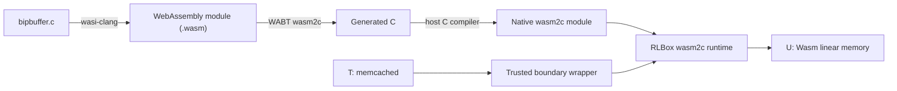
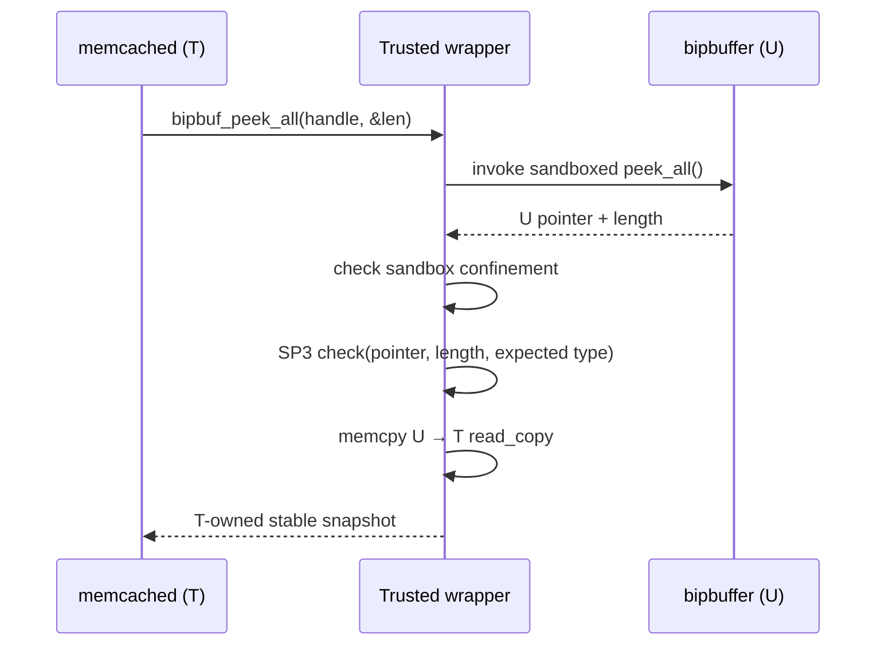
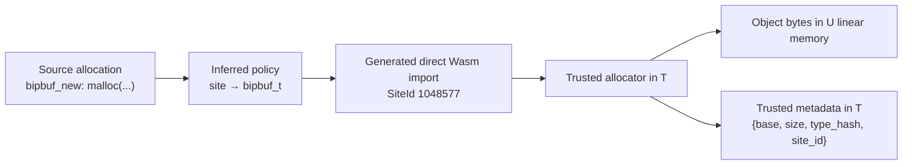

# InterSpec Memcached Evaluation

This report uses memcached as a running case study to evaluate the cost and behavior of InterSpec. Additional applications will be added after matched end-to-end results are available.

## 1. Benchmark and Workloads

### 1.1 Memcached and the isolated module

We evaluate **memcached 1.6.45**. The trusted application is memcached \(T\), while its upstream **bipbuffer** implementation is isolated as the untrusted component \(U\) using the RLBox **wasm2c** backend.

Bipbuffer is used by memcached for:

* worker logging,
* watcher output, and
* asynchronous LRU item bump queues.

These paths make bipbuffer a useful compartment boundary because they exchange data with the main server during realistic cache workloads rather than through a synthetic test harness.

### 1.2 Isolation boundary

The upstream bipbuffer API exposes **13 C functions with 21 explicit parameters**.

| Property | Value |
| --- | ---: |
| Isolated module | `bipbuffer.c` |
| Isolation backend | RLBox `wasm2c` |
| Interface functions | 13 |
| Explicit parameters | 21 |
| Functions accepting a buffer handle | 12 |
| Functions returning pointers | 5 |
| Memcached uses | worker logs, watchers, LRU bumps |

Representative interface functions include:

* **Write path:** `bipbuf_request`, `bipbuf_push`, `bipbuf_offer`
* **Read path:** `bipbuf_peek`, `bipbuf_peek_all`, `bipbuf_poll`
* **State management:** `bipbuf_new`, `bipbuf_free`, `bipbuf_used`, `bipbuf_unused`

In the isolated deployment, the application-visible `bipbuf_t *` is an opaque trusted handle. The actual bipbuffer object and its data reside in U's Wasm memory.

### 1.3 Compared configurations

We compare three matched configurations:

* **Native:** ordinary memcached with the native bipbuffer implementation.
* **RLBox:** bipbuffer runs inside RLBox `wasm2c`; boundary marshalling and copying remain enabled, but InterSpec allocation tracking and SP3 checks are disabled.
* **InterSpec:** the same RLBox deployment with trusted typed allocation metadata and SP3 validation enabled.

This separates:

* the cost of compartment isolation, measured as **RLBox vs. Native**, and
* the incremental cost of InterSpec enforcement, measured as **InterSpec vs. RLBox**.

### 1.4 Primary workloads

We vary both application concurrency and protected-boundary activity. This distinction matters because high request throughput does not necessarily imply frequent interactions with U.

| Level | Clients | Pipeline | GET / SET | Value size | Boundary activity | Purpose |
| --- | ---: | ---: | ---: | ---: | --- | --- |
| Light | 1 | 10 | 50 / 50 | 256 B | Low | Exposes fixed isolation costs with limited concurrency |
| Medium | 8 | 10 | 50 / 50 | 256 B | Moderate | Represents concurrent cache service under normal operation |
| Heavy | 2 | 2 | 50 / 50 | 256 B | High, watcher enabled | Continuously exercises protected worker and watcher queues |

**Light.** One client minimizes application parallelism, making fixed costs such as sandbox transitions and boundary handling easier to observe.

**Medium.** Eight clients preserve the same request mix while increasing concurrency, showing how isolation and validation costs behave under a more practical cache workload.

**Heavy.** The watcher subsystem remains active throughout the run, causing worker-log and watcher-output bipbuffers to be exercised continuously. We use moderate client pressure rather than maximum throughput so that the queue remains lossless.

### 1.5 Sensitivity workloads

We additionally use targeted workloads to test whether the result depends strongly on request composition:

* **Read heavy:** 8 clients, pipeline 16, 95% GET, 1 KiB values.
* **Write heavy:** 8 clients, pipeline 8, 90% SET, 256 B values.
* **Watcher light:** 1 client, pipeline 1, 50/50 GET/SET with an active watcher.

The primary light, medium, and heavy workloads form the main presentation. These sensitivity workloads are used to explain workload-specific behavior.

### 1.6 Validity and metrics

A watcher run is considered valid only when no protected work is silently dropped:

* `log_worker_dropped = 0`
* `log_watcher_skipped = 0`
* `lru_bumps_dropped = 0`

The primary metric is **throughput in Kops/s**. We additionally report:

* p99 response latency in **µs**,
* server CPU time in **µs/op**, and
* resident memory usage in **MiB**.

For final publication measurements, Native, RLBox, and InterSpec will be measured in paired repetitions on the same controlled host with identical workload parameters and disjoint server/client CPU affinity. Existing GitHub Actions results are treated as reference measurements for validating the experimental pipeline, not as final publication numbers.


## 2. Threat Model and Implementation

### 2.1 Threat model

We model memcached as the trusted compartment \(T\) and bipbuffer as the untrusted compartment \(U\). We assume the sandbox correctly isolates U from T memory; memcached, RLBox/wasm2c, InterSpec metadata, and the OS are trusted.

U may nevertheless be fully compromised and execute arbitrary behavior inside its sandbox. In particular, U may corrupt interface values returned to T, including pointers and lengths.

Our focus is **interface safety after isolation succeeds**. A U-controlled pointer is unsafe if it refers to:

* an untracked address,
* a released allocation,
* an allocation of the wrong type, or
* a range that exceeds the tracked object.

General control-flow integrity, side channels, and substitution between two simultaneously live objects of the same trusted type are outside the current SP3 guarantee.

### 2.2 RLBox wasm2c isolation

We isolate bipbuffer using RLBox's **wasm2c** backend. The build converts the untrusted C library into WebAssembly, then uses WABT's `wasm2c` translator to turn the Wasm module into C that is compiled into the memcached process.



Although T and U execute in one process, U uses Wasm's linear-memory model. Sandbox pointers are represented as 32-bit offsets, and generated loads/stores operate on the sandbox's linear-memory object rather than arbitrary memcached addresses. U therefore cannot directly dereference native T pointers.

For example, native memcached may call:

```c
unsigned char *p = bipbuf_peek_all(buf, &len);
```

In the isolated configuration, the trusted wrapper invokes the corresponding exported Wasm function through RLBox. The returned pointer is treated as a U-memory value and must be validated before T uses it.

### 2.3 Copy-based trusted wrapper

The **trusted boundary wrapper** preserves the original bipbuffer-facing API while preventing memcached from directly parsing mutable U memory.

For `bipbuf_peek_all`, the path is:



If U returns 128 bytes of log data, T never parses those bytes directly in U memory. The wrapper validates the complete 128-byte range and copies it into `read_copy` before returning it to memcached.

The T → U path uses the same principle:

* `bipbuf_request(size)` reserves space in U but exposes T's `write_copy` buffer to memcached.
* memcached writes into `write_copy`.
* `bipbuf_push(size)` validates the U destination, copies `write_copy` into U, and commits the write.
* `bipbuf_offer(data, size)` copies `data` into a persistent checked U character allocation before invoking U.

For these queue records, copying gives T a stable snapshot after validation and defines explicit enforcement points for boundary data.

### 2.4 Trusted typed allocator

RLBox confinement establishes that a pointer belongs to sandbox memory, but not that it refers to a **live allocation of the expected type and extent**. InterSpec therefore adds a T-controlled typed allocator for U memory.

At sandbox creation, the trusted wrapper:

* reserves one contiguous region in U's Wasm linear memory,
* creates an InterSpec `Runtime` over that region, and
* registers the inferred allocation-site-to-type policy.

Object bytes remain accessible to U, while authoritative metadata remains in T:

```text
{ base, size, type_hash, site_id }
```

#### Allocation-site provenance

U does not choose its trusted type. Policy generation rewrites each authorized allocation site to a **site-specific direct Wasm import**.



For memcached, the generated policy contains:

| Allocation site | Trusted type | Runtime SiteId |
| --- | --- | ---: |
| `bipbuf_new` allocation | `bipbuf_t` | 1048577 |
| input-copy helper | `char` | 1048578 |

Conceptually, the original allocation:

```c
malloc(sizeof(bipbuf_t) + size)
```

is rewritten to a site-specific imported allocator:

```c
interspec_wasm_alloc_memcached_site_1(size);
```

The Wasm call supplies only the requested size. The trusted host function already embeds the SiteId, and T maps that SiteId to the inferred type before recording the allocation. A compromised U therefore cannot allocate memory and falsely label it as another trusted type.

#### Allocation and lifetime tracking

The runtime suballocates the reserved region using an 8-byte-aligned bump pointer and indexes live allocations in a T-side ordered map. Normal memcached operation tracks two persistent allocations per queue: the `bipbuf_t` object and the character input buffer.

* **Allocate:** record `{base, size, type, site}`.
* **Release:** remove the allocation from trusted metadata.
* **Reallocate:** create a new allocation with the same trusted type/site and invalidate the old record.
* **Lookup:** find the live allocation containing a returned pointer, including interior pointers.

Released addresses are not immediately reused by this prototype, simplifying stale-pointer detection.

### 2.5 SP3 enforcement

Before T consumes a U-controlled pointer, the trusted wrapper performs:

1. **Sandbox confinement:** the pointer must resolve to U's Wasm linear memory.
2. **SP3 validation:** the pointer must lie in a live tracked allocation of the expected type, and the complete requested range must remain inside that allocation.

The runtime evaluates:

```c
check(pointer, requested_bytes, expected_type);
```

and returns `ok`, `untracked`, `wrong_type`, or `out_of_bounds`. A pointer whose allocation has been released is absent from trusted metadata and is rejected as `untracked`.

| Corruption | Enforcement |
| --- | --- |
| Pointer outside sandbox | RLBox / wrapper confinement |
| Pointer to ordinary untracked U memory | InterSpec: `untracked` |
| Pointer to allocation of another type | InterSpec: `wrong_type` |
| Pointer to released allocation | InterSpec: `untracked` |
| Valid pointer with excessive length | InterSpec: `out_of_bounds` |
| Different live object of the same type | Outside current SP3 guarantee |

### 2.6 Native pointers in the LRU queue

Memcached's LRU bump records originally contain native `item *` pointers. Passing these T pointers through U would expose trusted addresses and cannot be made safe by validating only the outer bipbuffer.

The wrapper therefore keeps each native item pointer in T and sends only a one-use integer handle through U. On return, T:

* resolves the handle in the originating queue,
* verifies the associated item hash,
* consumes the handle to prevent replay, and
* only then recovers the native pointer.

These LRU checks are shared by the RLBox and InterSpec sandboxed configurations. They therefore do not artificially inflate the incremental InterSpec overhead.

## 3. End-to-End Performance

### 3.1 Measurement

We measure complete memcached throughput with identical request streams across Native, RLBox, and InterSpec. The current numbers are **GitHub-hosted reference measurements** used to validate the experiment pipeline:

* 0.3 s warmup,
* 1 s measurement,
* 3 paired repetitions per configuration, and
* randomized configuration order.

Final paper numbers will use the same harness on controlled hardware with a 5 s warmup, 30 s measurement, 15 paired repetitions, and disjoint server/client CPU affinity.

Overhead percentages are medians of **paired per-repetition ratios**. They are therefore not necessarily equal to ratios computed from the displayed median throughputs. Positive values indicate lower throughput.

### 3.2 Results

| Workload | Native (Kops/s) | RLBox (Kops/s) | RLBox vs. Native | InterSpec (Kops/s) | InterSpec vs. Native | InterSpec vs. RLBox | p99 N/R/I (µs) |
| --- | ---: | ---: | ---: | ---: | ---: | ---: | ---: |
| Light: balanced 1c | 140.7 | 143.0 | -1.61% | 141.9 | -0.87% | +0.73% | 82.8 / 81.7 / 84.1 |
| Medium: balanced 8c | 691.4 | 646.9 | +6.44% | 665.0 | +3.82% | -2.04% | 307.0 / 312.6 / 314.8 |
| Heavy: watcher moderate | 75.2 | 72.4 | +2.18% | 72.8 | +3.19% | +1.03% | 79.0 / 81.4 / 82.3 |
| Read heavy, 1 KiB | 845.7 | 812.2 | +4.08% | 796.5 | +6.85% | +1.93% | 479.2 / 520.0 / 564.5 |
| Write heavy | 577.8 | 581.5 | +1.06% | 540.7 | +1.87% | +0.22% | 288.8 / 290.7 / 334.9 |
| Watcher light | 18.9 | 18.7 | +0.95% | 18.9 | -0.15% | -1.83% | 65.5 / 67.1 / 66.3 |

All six workloads completed without logger, watcher, or LRU drops.

### 3.3 Interpretation

The reference measurements suggest that the incremental cost of InterSpec over an already isolated RLBox deployment is small for these workloads. The largest positive InterSpec-vs.-RLBox reference delta is **1.93%** in the read-heavy workload; the boundary-intensive watcher workload measures **1.03%**.

Negative overheads are treated as measurement noise rather than speedups. The short hosted runs also show enough run-to-run variation that these numbers should not yet be used as publication claims.

The next section decomposes this end-to-end cost into the operations that execute at the boundary: RLBox invocation and copying, trusted allocator operations, SP3 validation, and the frequency of each SP3 check in the application.
